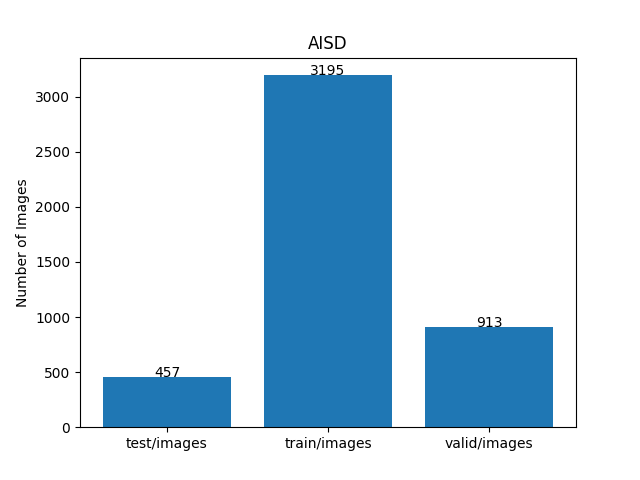

<h2>TensorFlow-FlexUNet-Image-Segmentation-Automated-Ischaemic-Stroke-NCCT (2025/09/21)</h2>
Toshiyuki Arai 
Software Laboratory antillia.com  
This is the first experiment of Image Segmentation for AISD NCCT (Automated Ischaemic Stroke Dataset Non-Contrast CT) based on 
our <a href="./src/TensorFlowFlexUNet.py">TensorFlowFlexUNet</a>
 (<b>TensorFlow Flexible UNet Image Segmentation Model for Multiclass</b>)
 and a 512x512 pixels 
<a href="https://drive.google.com/file/d/18BRAvO9E1Hsr-lh89dc0vi5KmA4h2-fN/view?usp=sharing">AISD-ImageMask-Dataset.zip</a>, which was derived by us from <a href="https://github.com/GriffinLiang/AISD"
<b>AISD</b>
</a>
 
 
As demonstrated in <a href="https://github.com/sarah-antillia/TensorFlow-FlexUNet-Image-Segmentation-STARE-Retinal-Vessel">
TensorFlow-FlexUNet-Image-Segmentation-STARE-Retinal-Vessel</a>,
 our Multiclass TensorFlowFlexUNet, which uses categorized masks, can also be applied to 
single-class image segmentation models. 
This is because it inherently treats the background as one category and your single-class mask data as 
a second category. In essence, your single-class segmentation model will operate with two categorized classes within our Multiclass UNet framework.
 
 

<b>Actual Image Segmentation for Images of 512x512 pixels</b> 
As shown below, the inferred masks predicted by our segmentation model trained on the 
our dataset appear similar to the ground truth masks, but they lack precision in certain areas. 
<table>
<tr>
<th>Input: image</th>
<th>Mask (ground_truth)</th>
<th>Prediction: inferred_mask</th>
</tr>
<tr>
<td></td>
<td></td>
<td></td>
</tr>

<tr>
<td></td>
<td></td>
<td></td>
</tr>

<tr>
<td></td>
<td></td>
<td></td>
</tr>
</table>

 

<h3>1. Dataset Citation</h3>
The original dataset used here has been taken from the github repository: 
<a href="https://github.com/GriffinLiang/AISD">
<b>AISD</b>
</a>
  
<b>Description</b> 
Acute ischemic stroke dataset contains 397 Non-Contrast-enhanced CT (NCCT) scans of acute ischemic stroke 
with the interval from symptom onset to CT less than 24 hours. The patients underwent diffusion-weighted MRI
 (DWI) within 24 hours after taking the CT. The slice thickness of NCCT is 5mm. 345 scans are used to train 
 and validate the model, and the remaining 52 scans are used for testing. Ischemic lesions are manually 
 contoured on NCCT by a doctor using MRI scans as the reference standard. Then a senior doctor double-reviews the labels.
 
 
<b>Download from Google Drive</b> 
<a href="https://drive.google.com/file/d/157f9aE3ZhRSdIuIbP2PRG8ub9JJWvMGk/view?usp=share_link">image.zip</a> 
<a href="https://drive.google.com/file/d/1d08fFpEvK4D6YTKfRlNuv_OlIxigZxl6/view?usp=share_link">mask.zip</a> 
 
<b>Citation</b>
<pre style="font-size: 16px;"> 
@inproceedings{liang2021SymmetryEnhancedAN,
  title={Symmetry-Enhanced Attention Network for Acute Ischemic Infarct Segmentation with Non-Contrast CT Images},    
  author={Kongming Liang, Kai Han, Xiuli Li, Xiaoqing Cheng, Yiming Li, Yizhou Wang, and Yizhou Yu},    
  booktitle={MICCAI},    
  year={2021}    
}
</pre>

 
<b>License</b> 
This dataset is made freely available to academic and non-academic entities for non-commercial purposes 
such as academic research, teaching, scientific publications, or personal experimentation.
 
 
<h3>
<a id="2">
2 AISD ImageMask Dataset
</a>
</h3>
 If you would like to train this AISD Segmentation model by yourself,
 please download  <a href="https://drive.google.com/file/d/18BRAvO9E1Hsr-lh89dc0vi5KmA4h2-fN/view?usp=sharing">AISD-ImageMask-Dataset.zip</a> on the google drive
, expand the downloaded and put it under <b>./dataset</b> folder to be. 
<pre>
./dataset
└─AISD
    ├─test
    │   ├─images
    │   └─masks
    ├─train
    │   ├─images
    │   └─masks
    └─valid
        ├─images
        └─masks
</pre>
In order to generate this dataset,we excluded all black empty masks and their corresponding images,
 which were really irrelevant for training our segmentation model, from the original datasets  
<a href="https://drive.google.com/file/d/157f9aE3ZhRSdIuIbP2PRG8ub9JJWvMGk/view?usp=share_link">image.zip</a> 
<a href="https://drive.google.com/file/d/1d08fFpEvK4D6YTKfRlNuv_OlIxigZxl6/view?usp=share_link">mask.zip</a> 
in <a href="https://github.com/GriffinLiang/AISD">
<b>AISD</b>
</a> 
Please note that commercial use of this dataset is prohibited.
  
<b>AISD Statistics</b> 
 
 
As shown above, the number of images of train and valid datasets is large enough to use for a training set of our segmentation model.
 
 

<b>Train_images_sample</b> 

 
<b>Train_masks_sample</b> 

 

<h3>
3 Train TensorFlowUNet Model
</h3>
 We have trained AISD TensorFlowFlexUNet Model by using the following
<a href="./projects/TensorFlowFlexUNet/AISD/train_eval_infer.config"> <b>train_eval_infer.config</b></a> file.  
Please move to ./projects/TensorFlowFlexUNet/AISDand run the following bat file. 
<pre>
>1.train.bat
</pre>
, which simply runs the following command. 
<pre>
>python ../../../src/TensorFlowFlexUNetTrainer.py ./train_eval_infer.config
</pre>

<b>Model parameters</b> 
Defined a small base_filters = 16, large base_kernels = (9,9), and large diation = (3,3) for the first Conv Layer of Encoder Block of 
<a href="./src/TensorFlowUNet.py">TensorFlowUNet.py</a> 
and a large num_layers (including a bridge between Encoder and Decoder Blocks).
<pre>
[model]
image_width    = 512
image_height   = 512
image_channels = 3

num_classes    = 2

base_filters   = 16
base_kernels   = (9,9)
num_layers     = 8
dropout_rate   = 0.05
dilation       = (3,3)

</pre>

<b>Learning rate</b> 
Defined a small learning rate.  
<pre>
[model]
learning_rate  = 0.00005
</pre>

<b>Online augmentation</b> 
Disabled our online augmentation.  
<pre>
[model]
model         = "TensorFlowFlexUNet"
generator     = False
</pre>

<b>Loss and metrics functions</b> 
Specified "categorical_crossentropy" and <a href="./src/dice_coef_multiclass.py">"dice_coef_multiclass"</a>. 
<pre>
[model]
loss           = "categorical_crossentropy"
metrics        = ["dice_coef_multiclass"]
</pre>
<b>Learning rate reducer callback</b> 
Enabled learing_rate_reducer callback, and a small reducer_patience.
<pre> 
[train]
learning_rate_reducer = True
reducer_factor     = 0.5
reducer_patience   = 4
</pre>

<b>Early stopping callback</b> 
Enabled early stopping callback with patience parameter.
<pre>
[train]
patience      = 10
</pre>

<b>RGB Color map</b> 
rgb color map dict for AISD 1+1 classes.
<pre>
[mask]
mask_datatype    = "categorized"
mask_file_format = ".png"

;     Background:black,  Ischaemic-Stroke: white 
rgb_map = {(0,0,0):0,(255, 255, 255):1,}
</pre>

<b>Epoch change inference callback</b> 
Enabled <a href="./src/EpochChangeInferencer.py">epoch_change_infer callback (EpochChangeInferencer.py)</a></b>. 
<pre>
[train]
epoch_change_infer       = True
epoch_change_infer_dir   =  "./epoch_change_infer"
num_infer_images         = 6
</pre>

By using this callback, on every epoch_change, the inference procedure can be called
 for 6 images in <b>mini_test</b> folder. This will help you confirm how the predicted mask changes 
 at each epoch during your training process.    

<b>Epoch_change_inference output at starting (epoch 1,2,3)</b> 
 
 
<b>Epoch_change_inference output at middlepoint (epoch 23,24 25)</b> 
 
 

<b>Epoch_change_inference output at ending (epoch 47,48,49)</b> 
 
 

In this experiment, the training process was stopped at epoch 49 by EarlyStopping Callback.  
 
 

<a href="./projects/TensorFlowFlexUNet/AISD/eval/train_metrics.csv">train_metrics.csv</a> 
 

 
<a href="./projects/TensorFlowFlexUNet/AISD/eval/train_losses.csv">train_losses.csv</a> 
 

 

<h3>
4 Evaluation
</h3>
Please move to a <b>./projects/TensorFlowFlexUNet/AISD</b> folder, 
and run the following bat file to evaluate TensorFlowUNet model for AISD. 
<pre>
./2.evaluate.bat
</pre>
This bat file simply runs the following command.
<pre>
python ../../../src/TensorFlowFlexUNetEvaluator.py ./train_eval_infer.config
</pre>

Evaluation console output: 

  Image-Segmentation-AISD

<a href="./projects/TensorFlowFlexUNet/AISD/evaluation.csv">evaluation.csv</a> 

The loss (bce_dice_loss) to this AISD/test was not so low, but dice_coef high as shown below.
 
<pre>
categorical_crossentropy,0.0215
dice_coef_multiclass,0.9904
</pre>
 
<h3>
5 Inference
</h3>
Please move to a <b>./projects/TensorFlowFlexUNet/AISD</b> folder 
,and run the following bat file to infer segmentation regions for images by the Trained-TensorFlowUNet model for AISD. 
<pre>
./3.infer.bat
</pre>
This simply runs the following command.
<pre>
python ../../../src/TensorFlowFlexUNetInferencer.py ./train_eval_infer.config
</pre>

<b>mini_test_images</b> 
 
<b>mini_test_mask(ground_truth)</b> 
 

<b>Inferred test masks</b> 
As shown below, this segmentation model failed to detect some Ischemia lesions. 

 
 

<b>Enlarged images and masks </b> 

<table>
<tr>
<th>Image</th>
<th>Mask (ground_truth)</th>
<th>Inferred-mask</th>
</tr>

<tr>
<td></td>
<td></td>
<td></td>
</tr>

<tr>
<td></td>
<td></td>
<td></td>
</tr>

<tr>
<td></td>
<td></td>
<td></td>
</tr>
<tr>
<td></td>
<td></td>
<td></td>
</tr>
<tr>
<td></td>
<td></td>
<td></td>
</tr>
<tr>
<td></td>
<td></td>
<td></td>
</tr>
</table>

 

<h3>
References
</h3>
<b>1. Automated Segmentation of Ischemic Stroke Lesions in Non-Contrast Computed Tomography Images for Enhanced Treatment and Prognosis</b> 
Toufiq Musah, Prince Ebenezer Adjei, Kojo Obed Otoo 

<a href="https://arxiv.org/html/2411.09402">
https://arxiv.org/html/2411.09402
</a>
 
 
<b>2. APIS: a paired CT-MRI dataset for ischemic stroke segmentation - methods and challenges </b> 
Santiago Gómez, Edgar Rangel, Daniel Mantilla, Andrés Ortiz, Paul Camacho, Ezequiel de la Rosa, Joaquin Seia,  
Jan S. Kirschke, Yihao Li, Mostafa El Habib Daho & Fabio Martínez 

<a href="https://www.nature.com/articles/s41598-024-71273-x">
https://www.nature.com/articles/s41598-024-71273-x
</a>
 
 

<b>3. TensorFlow-FlexUNet-Image-Segmentation-Brain-Stroke-CT </b> 
Toshiyuki Arai antillia.com 
<a href="https://github.com/sarah-antillia/TensorFlow-FlexUNet-Image-Segmentation-Brain-Stroke-CT">
https://github.com/sarah-antillia/TensorFlow-FlexUNet-Image-Segmentation-Brain-Stroke-CT
</a>
 
 

